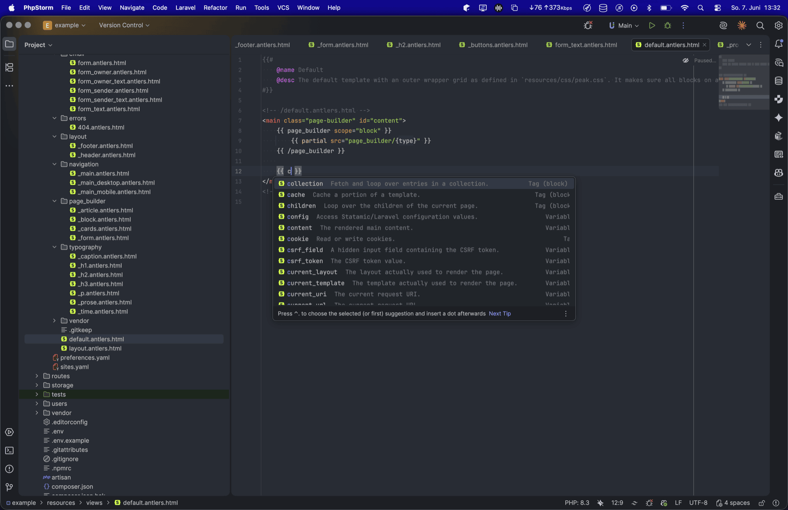
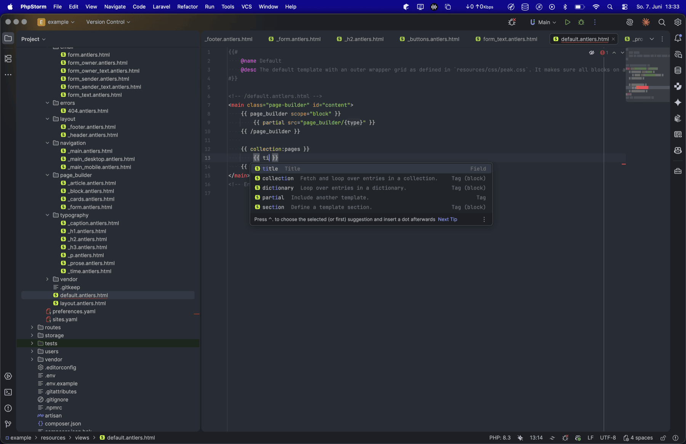
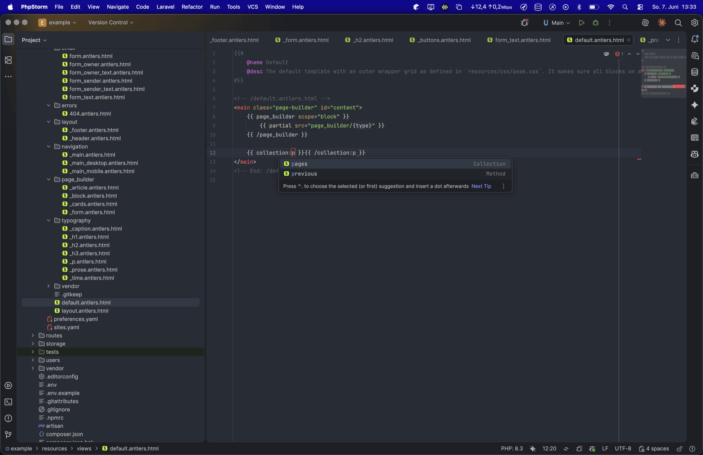
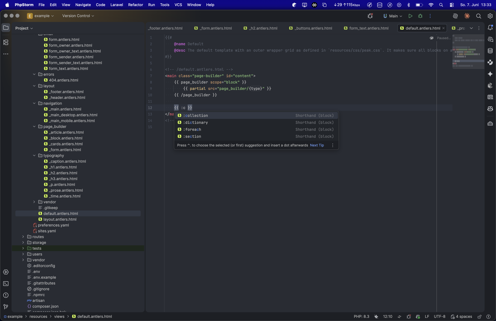
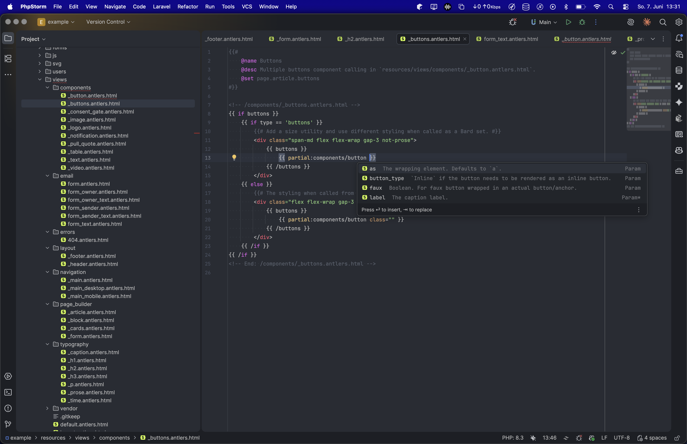

# Antlers

**[Statamic](https://statamic.dev) Antlers** language support for **IntelliJ-based IDEs**

<!-- Plugin description -->
The plugin brings **[Statamic](https://statamic.dev) Antlers** support to `*.antlers.html` and
`*.antlers.php` views, parsing Antlers as a template language layered over HTML/CSS — so you get full
Antlers intelligence inside `{{ }}` alongside the regular markup tooling around it. It reads your project's
blueprints, fieldsets, collections, taxonomies, navigations, forms, and a view's YAML front matter,
so completion, navigation, and documentation are blueprint- and view-aware — and **scope-aware**:
the variables offered and resolved are the ones actually available where your cursor is (inside a
`{{ collection }}` loop, a related entry, a `{{ nav }}` tree, a `{{ form }}`, a page-mapped template,
or an `@collection`-hinted view).

## Features

**Editing**
- Syntax highlighting for tags, variables, strings, numbers, comments, and PHP/noparse blocks, with
  **operators highlighted as keywords** — the logical word operators (`and`/`or`/`xor`/`not`), the
  query/builder operators (`where`/`merge`/`orderby`/`groupby`/`take`/`skip`/`pluck`), the inline
  `switch` operator, the `void` placeholder, and the symbolic comparison/math operators — including the
  `:` of a ternary/elvis (`a ? b : c`, `x ?: y`) — all read distinctly from plain text (separate
  **Operator** and **Punctuation** colors). All colors are customizable (*Settings → Editor → Color
  Scheme → Antlers*). Antlers interpolation inside strings (`"object-position: {logo:focus_css}"`) is
  highlighted as real Antlers. Antlers that generates `<script>`/`<style>` content (e.g. a JSON-LD graph
  built with `{{ if }}` loops) no longer triggers false JS/CSS/JSON parser errors. Plus, a view's
  `---` … `---` front matter is a real **YAML** island — comments, highlighting, and YAML
  errors/warnings/completion all work inside it.
- Brace matching (`{{ }}`, comments, noparse, PHP), commenting (`{{# … #}}`), and `{{ }}` auto-insert.
- **Smart block editing**: completing a tag drops the caret where you'll actually type — a parameter
  slot for tags that take parameters, or straight into the block for tags that don't. **Tab** walks
  through further parameter slots (jumping past quoted values) and then into the block, and a single
  **Enter** inside an empty `{{ tag }}{{ /tag }}` expands it to an indented body with the closing tag on
  its own line.
- Code folding for paired tags, conditions, comments, noparse and PHP blocks.
- A **Structure view** outline of the template's tag/condition nesting and partial includes.
- **Template IDE hints**: `{{# @… #}}` directive comments (`@name`, `@desc`, `@param`, `@deprecated`,
  `@entry`, `@collection`, `@blueprint`, `@set`) are highlighted and completed after `@`. A leading
  `{{# @collection|@entry|@blueprint <handle> #}}` hint tells the plugin which blueprint a view's
  variables come from, making completion and navigation field-aware even when there's no collection
  mapping for the file.

**Completion** (backed by a bundled Statamic 5 & 6 catalog — tailored to the version detected in your `composer.json` — plus custom tags/modifiers discovered in your project)
- Tags, tag methods/sub-tags, parameter names, and **parameter values** — partial paths for
  `partial:src=`, collection/taxonomy handles for `from=`/`in=`/…, field names for `sort=`, and
  `true`/`false` for boolean params.
- **Tag query conditions** — in `{{ collection:blog title:contains="…" }}` (also `taxonomy`/`users`),
  the condition operators (`is`, `contains`, `starts_with`, `is_after`, `in`, `gt`, …) are completed
  after a `field:`, the target blueprint fields are offered as condition targets, and the value side is
  completed too (`status:is="published"`, `exists="true"`, `is_after="now"`). The operator is highlighted
  and hovering it shows its documentation, and the **field resolves to its blueprint declaration** — so
  Ctrl/⌘-click, Find Usages, and Rename work on a field used inside a condition.
- Logic keywords (`if`, `unless`, `else`, `elseif`, `endif`) and the query/builder operators
  (`where`, `merge`, `orderby`, `groupby`, `take`, `skip`, `pluck`) offered inside `{{ }}`, context-aware —
  the condition followers (`else`/`elseif`/`endif`) appear only inside the matching open block.
- Modifiers (after `|`) with their arguments — including modifiers used inside conditions
  (`{{ if code | contains("…") }}`).
- Collection/taxonomy/form/nav handles after the colon shorthand (`{{ collection:<caret> }}`).
- Variables: blueprint fields, system variables, loop variables (including the `next:`/`prev:`
  accessors, `{{ foreach }}` key/value, and `groupby` key/values), nav-tree, and form variables —
  resolved for the current scope (inside `{{ collection }}`, `{{ nav }}`, `{{ form }}`, `{{ foreach }}`,
  page-mapped templates, etc.).
- **View front matter**: keys declared in a view's `---` … `---` block are completed after `{{ view: }}`.
- **Partial parameters**: at a partial include (`{{ partial:components/button … }}`), the parameters the
  partial declares with `{{# @param* label … #}}` directive comments are completed by name (required ones
  marked `*`; `@deprecated` ones offered struck through with a *Deprecated* marker), and hovering a param
  name shows its description — the migration note for a deprecated one.
- Member/relationship completion when dotting into grid/group fields and related entries.

**Navigation & docs**
- Go-to-declaration from a `{{ variable }}` to its blueprint field, from `{{ partial:… }}` to the
  partial file (including `partials/`, underscored, dotted-nested, and `addon::`-namespaced partials —
  resolving to the published view under `resources/views/vendor/`, or the addon's own view in `vendor/`),
  from `{{ view:foo }}` to its front-matter key, from `{{ svg:… }}` / `{{ svg src="…" }}` to the SVG file
  (resolved through Statamic's `resources/svg` → `resources` → `public/svg` → `public` cascade), from a
  literal media path written in Antlers (glide `src="/img/hero.jpg"`, asset `url="…"`, or a bare
  `{{ "/img/logo.png" }}`) to the file under `public/` (and `public/assets/`), and from a custom
  tag/modifier name to its PHP class — including tags used in the inline form (`{{ x = {your_tag …} }}`).
- Quick documentation (hover) for tags, modifiers, parameters, and variables (including `view:` keys),
  and for partial-include parameters (from the partial's `@param` hints); plus **parameter info**
  (Ctrl/⌘P) for modifier arguments.

**Diagnostics**
- A tag-balance annotator (unclosed / stray / mismatched-handle conditions and paired tags) that leaves
  unknown/addon tags alone, an unknown-modifier inspection, and an unresolved-partial inspection — all
  with **quick-fixes**: *Insert closing `{{ /… }}`* for an unclosed tag/condition (keeping the shorthand
  handle, `{{ /collection:drinks }}`), *Remove stray closing tag* for an orphan closer, *Change to `…`*
  (closest-match suggestions) for a mistyped modifier, and *Create partial* to create the missing view
  file for an unresolved `{{ partial:… }}`.

**Refactoring**
- **Rename** and **Find Usages** for partials (file ↔ every include) and for blueprint field
  handles (the YAML `handle:` ↔ every `{{ … }}` usage, across collections that import a shared
  fieldset).

**Formatting**
- On *Reformat Code*: one space inside `{{ }}` delimiters and around `|`; paired-tag and condition
  bodies indented one level per nesting, with `{{ else }}`/`{{ elseif }}` dedented back to the
  `{{ if }}`; multi-line arrays inside `{{ }}` bracket-nested; multi-line tag parameters indented under
  the `{{` line; and template-named HTML tags (`<{{ html_tag }} … >` … `</{{ html_tag }}>`) indented too.
- **Indentation-only — designed to coexist with Prettier** (it never reflows or breaks lines). Indent
  size and tabs are configurable in *Settings → Editor → Code Style → Antlers*, and a master toggle in
  *Settings → Languages & Frameworks → Antlers* turns Antlers formatting off entirely so you can defer
  to Prettier.

**Convenience**
- A small set of Antlers live templates (`if`, `unless`, `coll`, `partial`, …) and a
  *New → Antlers Template* file action.
<!-- Plugin description end -->

## See it in action

**Context-aware completion inside `{{ }}`** — tags and sub-tags plus system and blueprint variables,
each with its type and a one-line description.

**Scope-aware fields** — inside a `{{ collection:pages }}` loop, completion offers that collection
blueprint's actual fields (here `title`), not a generic list.

**Handle completion** — collection / taxonomy / form / nav handles after the colon shorthand.

**Shorthand block tags** — `collection`, `foreach`, `section`, … from the bundled Statamic catalog.

**Partial parameter hints** — at a `{{ partial: }}` include, the parameters the partial declares with
`{{# @param #}}` comments (required ones marked) are completed and documented inline.

## Compatibility

- **Statamic 5 and 6.** Antlers syntax is shared across both versions; the bundled tag/modifier catalog
  is tailored to the version detected in your project's `composer.json` (falling back to the latest when
  none is found), and custom/addon tags are discovered by scanning your project.
- Both `*.antlers.html` and `*.antlers.php` views.
- IntelliJ-based IDEs, version **2025.2 or newer** (IntelliJ IDEA, PhpStorm, WebStorm, and friends). PHP
  inside `{{$ … $}}` / `{{? … ?}}` blocks is highlighted where the JetBrains PHP plugin is available
  (PhpStorm / IDEA Ultimate); everything else works everywhere.

## Known limitations

- When an **HTML tag name is itself an Antlers interpolation** (`<{{ as or 'h2' }}> … </{{ as or 'h2' }}>`),
  some HTML coloring nuance inside that element can still differ from a normal tag — the IDE re-lexes each
  outer-HTML segment independently, so the part after `}}` loses its in-tag context. The common cases are
  handled, though: attribute **names and values** are re-colored to match normal tags, and the spurious HTML
  errors such tags trigger ("Closing tag matches nothing", and "Closing tag name is missing" on multi-line
  tags) are suppressed.
- **Reformat Code** indents by nesting depth but does not add an extra level for the *continuation lines of
  a multi-line HTML attribute value* on a template-named tag (e.g. a wrapped `class="…"` on
  `<{{ as }} … >`). Such lines sit at the tag's attribute level rather than one deeper. Everything else —
  HTML elements, Antlers pairs/loops/conditions, and multi-line `{{ }}` params — indents to the correct
  combined depth.
- **Media-path go-to-declaration** resolves files under `public/` (and the default `public/assets/`). An
  asset container mapped to a **custom filesystem disk** isn't resolved — that disk's root lives in
  `config/filesystems.php`, which the plugin doesn't read.

## Installation

- Using the IDE built-in plugin system:

  <kbd>Settings/Preferences</kbd> > <kbd>Plugins</kbd> > <kbd>Marketplace</kbd> > <kbd>Search for "Antlers"</kbd> >
  <kbd>Install</kbd>

- Using JetBrains Marketplace:

  Go to [JetBrains Marketplace](https://plugins.jetbrains.com/plugin/32139-antlers) and install it by clicking the <kbd>Install to ...</kbd> button in case your IDE is running.

  You can also download the [latest release](https://plugins.jetbrains.com/plugin/32139-antlers/versions) from JetBrains Marketplace and install it manually using
  <kbd>Settings/Preferences</kbd> > <kbd>Plugins</kbd> > <kbd>⚙️</kbd> > <kbd>Install plugin from disk...</kbd>

- Manually:

  Download the [latest release](https://github.com/BALOTIAS/intellij-antlers/releases/latest) and install it manually using
  <kbd>Settings/Preferences</kbd> > <kbd>Plugins</kbd> > <kbd>⚙️</kbd> > <kbd>Install plugin from disk...</kbd>

## License

Released under the [MIT License](LICENSE) © Matthias Balota.

---
Plugin based on the [IntelliJ Platform Plugin Template][template].

[template]: https://github.com/JetBrains/intellij-platform-plugin-template
